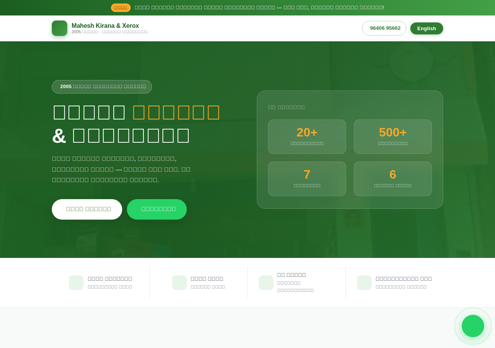
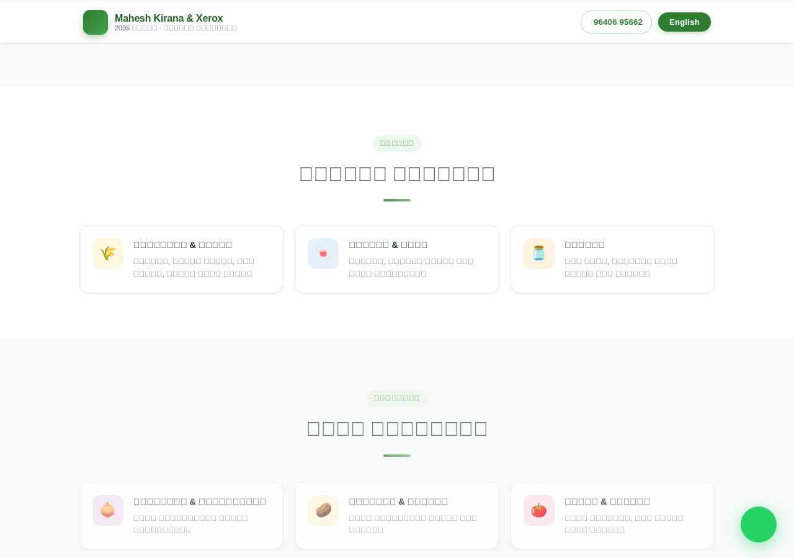
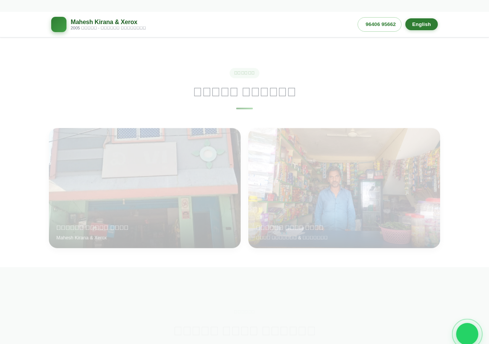
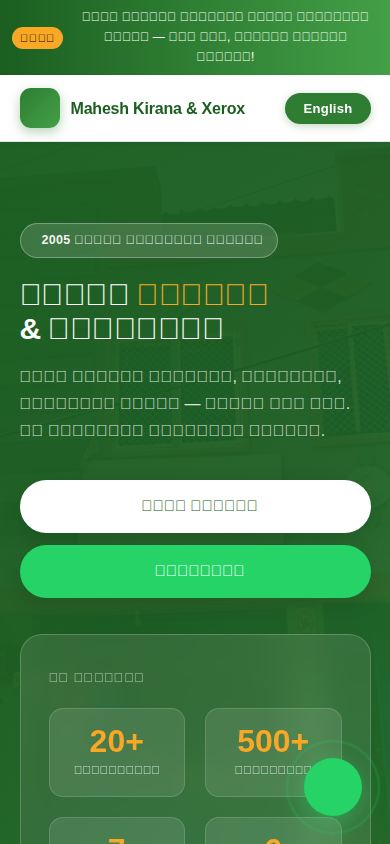

# Mahesh Kirana & Xerox — Professional Website

A modern, bilingual (Telugu / English) website for **Mahesh Kirana & Xerox**, a trusted neighbourhood grocery and services store since 2005.

---

## 🖥️ Live Preview — What's New

> **This branch contains a complete professional redesign.** Here is what the website looks like now:

| Hero (with shop photo background) | Product Cards |
|---|---|
|  |  |

| Shop Photo Gallery | Mobile View |
|---|---|
|  |  |

### What changed vs. the old version

| Feature | Before | After |
|---|---|---|
| Hero | Plain light-green box | Full-width shop photo with dark overlay + animated trust card |
| Products | Comma-separated text | Icon cards with name & description |
| Services | Plain text list | Visual service cards with top-border reveal animation |
| Navigation | Simple green bar | Sticky glass-effect navbar with phone link |
| Offer banner | ✗ | Animated promotional banner at the top |
| Opening hours | ✗ | Day-by-day table with today highlighted |
| Gallery | Plain images | Full-width cards with hover-zoom & caption overlay |
| Animations | ✗ | Scroll-reveal fade-ins on every section |
| WhatsApp | Just a button | Floating action button (bottom-right, always visible) |
| Language toggle | Simple swap | Full bilingual switch (Telugu ↔ English) for all content |
| Footer | One-line green bar | Three-column footer with brand desc, links & contact |
| Mobile | Minimal | Fully responsive, mobile-first layout |

---

## 👀 How to View the Website

### Option 1 — Double-click (zero setup)

Open your file manager, find **`index.html`**, and double-click it.  
It opens in any browser. All features work offline except the Google Maps embed.

---

### Option 2 — VS Code Live Server (auto-refresh while editing)

1. Install the **[Live Server](https://marketplace.visualstudio.com/items?itemName=ritwickdey.LiveServer)** extension in VS Code.  
2. Open the project folder in VS Code.  
3. Right-click `index.html` → **"Open with Live Server"**.  
4. Browser opens at `http://127.0.0.1:5500` and refreshes every time you save.

---

### Option 3 — Python (no extra installs)

```bash
python3 -m http.server 3000
```

Open **[http://localhost:3000](http://localhost:3000)**.

---

### Option 4 — npm start (one command)

> Requires [Node.js](https://nodejs.org) ≥ 18

```bash
npm start
```

Opens the site at **[http://localhost:3000](http://localhost:3000)**.

---

### Option 5 — GitHub Pages (free, public URL)

1. Push to GitHub.
2. **Settings → Pages → Branch: `main`, Folder: `/ (root)`** → Save.
3. Your site is live at `https://<username>.github.io/kirana-shop-website/`

> **Important:** If you downloaded the repository as a ZIP, make sure you are using the files from the **`copilot/transform-website-into-professional`** branch (or merge the pull request into `main` first) — the professional design lives in that branch.

---

## 🌐 Language Toggle

Click **English / తెలుగు** in the navbar to switch all text instantly.

---

## 🗂️ File Structure

```
kirana-shop-website/
├── index.html             # Complete website (HTML + CSS + JS — single file)
├── shop_front_photo.jpg   # Hero background image
├── shop.jpg               # Gallery image
├── package.json           # npm start script
├── docs/                  # Preview screenshots
└── README.md
```

---

## ✏️ Editing Content

All text is in the `data` object inside `index.html` (near the bottom).  
Edit the `te` (Telugu) and `en` (English) keys — no need to touch HTML or CSS.

---

## 🏗️ Tech Stack

| Technology | Use |
|---|---|
| HTML5 + CSS3 | Structure & styling (CSS Grid, Flexbox, custom properties) |
| Vanilla JavaScript | Language toggle, IntersectionObserver scroll-reveal, dynamic rendering |
| [Google Fonts](https://fonts.google.com) | Noto Sans Telugu, Inter |
| [Font Awesome 6.5](https://fontawesome.com) | Icons |
| Google Maps Embed | Location section |

No build step, no framework, no npm dependencies.

---

## 📞 Contact

| | |
|---|---|
| Phone | 96406 95662 |
| WhatsApp | [wa.me/919640695662](https://wa.me/919640695662) |
| Location | Visakhapatnam, Andhra Pradesh |
| Hours | Mon – Sat, 7:00 AM – 9:00 PM |

---

© 2005 – 2026 Mahesh Kirana & Xerox
